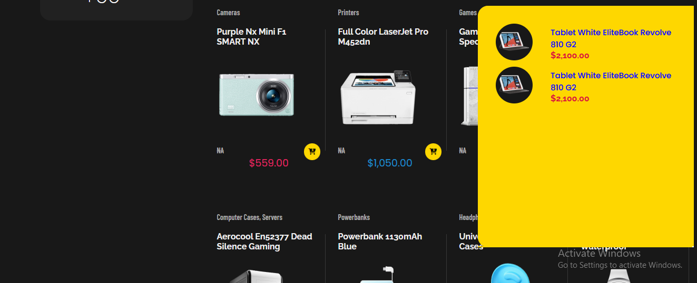
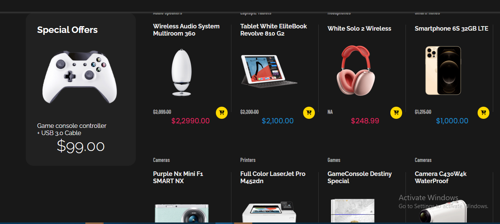

# E-Commerce Project

<!--  -->

A simple e-commerce project showcasing various products.

## Description

This project is an e-commerce application that allows users to browse and purchase products online. It provides a user-friendly interface for searching, viewing product details, adding items to the shopping cart. Just try it out!
## Features

- Product catalog with search functionality
- Product details page
- View product item details
- Shopping cart management

## Installation

1. Clone the repository:

```shell
git clone https://github.com/ben64103/e-commerce.git
```

## Usage

To start the application, run the following command:


Open your browser and visit `https://ben64103.github.io/eccomerce-website/` to access the application.

## Screenshots




